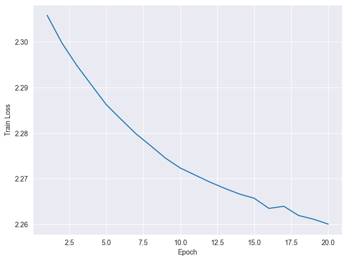
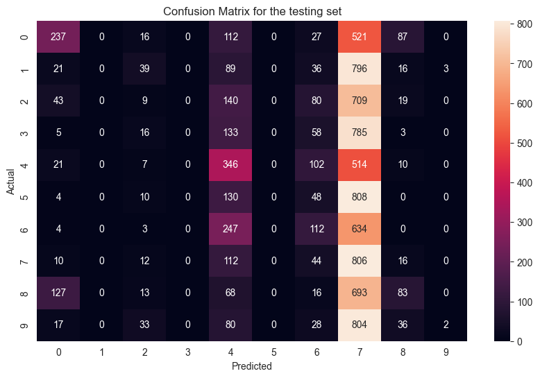

# Image Classification using Radial Basis Function Network

This GitHub repository provides an implementation and evaluation of a two-layer Radial Basis Function (RBF) neural network for image classification using the CIFAR-10 dataset. The project aims to classify images with a network architecture that includes a hidden RBF layer and an output layer, and then compares the results with those obtained from a Multi-Layer Perceptron (MLP) network.

## Problem Definition

The primary objective of this project is to train a Radial Basis Function neural network to act as a classifier for the CIFAR-10 dataset. The network consists of a hidden layer with 20 neurons, employing a Gaussian activation function. The training is performed using the error backpropagation algorithm over 20 epochs on the CIFAR-10 training set. The performance evaluation includes calculating the confusion matrix, accuracy measures, and F1 score for both training and test sets. A comparative analysis is conducted to assess the learning capabilities of MLP and RBF networks.

## Implementation

### Finding Centers using Minibatch K-Means

The implementation starts by finding suitable centers for the RBF neurons. Minibatch K-Means is used to efficiently identify 20 clusters in the training data. This technique iteratively processes the data in small batches, updates centroids, and ultimately identifies the centers for the RBF neurons.

### Calculation of dmax for the Grid Radius

The "dmax" parameter is crucial for determining the radius of influence for each RBF neuron. It represents the maximum distance between any two vectors (centers) obtained from Minibatch K-Means. The calculation of "dmax" ensures that RBF neurons effectively capture data patterns.

### RBF Layer

The RBF layer transforms input data into a higher-dimensional feature space using radial basis functions. This layer consists of RBF neurons, each representing a central point in the feature space. The implementation includes a class for the RBF layer, which calculates the L2-norm distance between inputs and centers, applies the exponential expression using the sigma value, and handles gradient updates for centers and sigma during training.

### Output Layer

A dense layer is used as the output layer, followed by a Softmax activation function and a cross-entropy loss function for multi-class classification. The SGD optimizer with a learning rate of 0.1 is employed to train the network.

### Architecture

The neural network architecture includes an RBF layer followed by a dense layer. The output layer consists of 10 neurons corresponding to the number of classes in CIFAR-10. The Softmax activation generates class probabilities, and the cross-entropy loss function is used for training.

## Evaluation of Results

The results of the Radial Basis Function Neural Network (RBFNN) with cross-entropy loss and Softmax activation show poorer performance compared to MLP. Several factors contribute to this discrepancy:

1. **Loss Function Choice:** Cross-entropy is designed for classification problems with mutually exclusive classes, while RBFNNs may not naturally generate class probabilities. This choice can lead to suboptimal training and classification performance.

2. **Softmax Activation:** The Softmax activation may not be ideal for RBFNNs, as it assumes mutually exclusive classes, while RBFNNs are better suited for handling overlapping and continuous outputs. This mismatch can limit the model's ability to capture complex decision boundaries.

3. **Training Approach:** RBFNNs can benefit from a different training approach, such as using the mean squared error (MSE) loss function and the pseudo-inverse technique. MSE enables better approximation of target values, and the pseudo-inverse technique allows direct weight matrix calculation, bypassing iterative training.

  

  

Please refer to the project files and code for a detailed understanding of the implementation and results.
